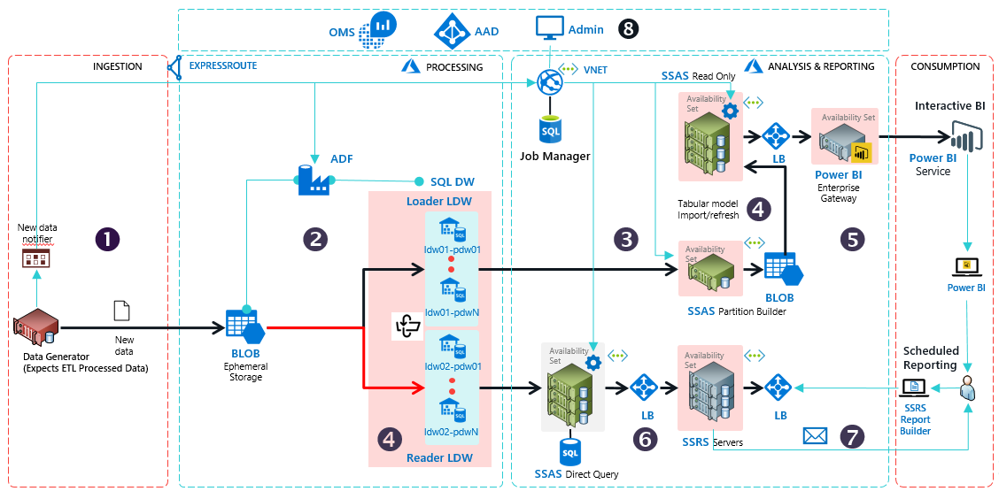

# [Technical Reference Implementation for Enterprise BI and Reporting](https://gallery.cortanaintelligence.com/Solution/enterprisebiandreporting)

<a href="https://start.cortanaintelligence.com/track/Deployments?type=enterprisebiandreporting" target="_blank">View deployed solution &gt;</a>

## Summary
<Guide type="Summary">
This solution creates a reference implementation for an end to end BI and Reporting platform built using SQL Data Warehouse, SQL Server Analysis Services, SQL Server Reporting Services, Power BI, and custom solutions for job managment and coordination. Customers who are planning to build such a system for their enterprise applications, or  onboarding their on-prem solution can use this TRI to get a jumpstart on the infrastructure implementation, and customize it for their needs. System Integrators can partner with us to use this reference implementation to accelrate their customer deployments.
</Guide>

## Description

#### Estimated Provisioning Time: <Guide type="EstimatedTime">2 Hours</Guide>
<Guide type="Description">
Azure offers a rich data and analytics platform for customers and ISVs seeking to build scalable BI and reporting solutions. However, customers face pragmatic challenges in building the right infrastructure for enterprise-grade production systems. They have to evaluate the various products for security, scale, performance and geo-availability requirements. They have to understand service features and their interoperability, and plan to address any perceived gaps with custom software. This takes time, effort, and many times, the end to end system architecture they design is sub-optimal. Consequently, the promise and expectations set during proof-of-concept (POC) stages do not translate to robust production systems in the expected time to market.

This TRI addresses this customer pain by providing a reference implementation that is:
- pre-built based on selected and stable Azure components proven to work in enterprise BI and reporting scenarios
- easily configured and deployed to an Azure subscription within a few hours
- bundled with software to handle all the operational essentials for a full fledged production system
- tested end to end against large workloads

Once deployed, the TRI can be used as-is, or customized to fit the application needs using the technical documentation that is provided with the TRI. This enables the customer to build the solution that delivers the business goals based on a robust and functional infrastructure.

## Audience
Business decision makers and evaluators can review the content in the **Solution Overview LINK TBD** folder to understand the benefits of using the TRI. For more information on how to tailor the TRI for your needs, **connect with one of our partners LINK TBD**.

It is recommended that the TRI is reviewed and deployed by a person who is familiar with operational concepts of data warehousing, business intelligence, and analytics. Knowledge of Azure is a plus, but not mandatory. The technical guides provide pointers to Azure documentation for all the resources employed in this TRI.

## Architecture 

### How the TRI works, in a Nutshell

TRI has 4 segments – Ingestion, Processing, Analysis & Reporting, and Consumption

1.	A data generator, provided in place of the customer's data source, queries the job manager for a staging [Azure Blob](https://docs.microsoft.com/en-us/azure/storage/) storage. The job manager returns the handle to an ephemeral BLOB, and the data generator pushes data files into this storage. The TRI is designed with _a key assumption that the data that is to be ingested into the system has been ETL-processed_ for reporting and analytics.
2.	When the job manager detects fresh data in the Azure Blob, it creates a dynamic one time [Azure data factory](https://docs.microsoft.com/en-us/azure/data-factory/v1/data-factory-introduction) pipeline to load the data from the Blob into a _logical_ _Loader_ SQL Data Warehouse (DW) using [Polybase](https://docs.microsoft.com/en-us/sql/relational-databases/polybase/get-started-with-polybase). The logical SQL DW is a design provided by the TRI for scalability and performance, to allow multiple physical [SQL Data Warehouse](https://docs.microsoft.com/en-us/azure/sql-data-warehouse/) replicas to handle large scale concurrent queries.
3.	Interactive BI is best served by cached analytical models to enable fast drilldowns for summaries aggregated over various dimensions or pivots. As data lands in DW tables, a [SSAS partition builder](https://docs.microsoft.com/en-us/sql/analysis-services/multidimensional-models-olap-logical-cube-objects/partitions-analysis-services-multidimensional-data) starts refreshing the tabular models that are dependent on these tables.
4.	After a preconfigured duration, the job manager flips the _Loader_ DW to become the _Reader_ DW, ready to serve queries for report generation. The current _Reader_ flips to become the _Loader_, and the job manager starts data load on the _Loader_. This _Loader_-_Reader_ pairing in another design provided by the TRI for scalability and performance of queries against the data warehouse. When this flip happens, the Partition Builder commits the tabular models into files in a Blob. This Blob is then loaded into 
an [availability-set of SSAS read-only servers](https://docs.microsoft.com/en-us/sql/analysis-services/instances/high-availability-and-scalability-in-analysis-services).
5. You can set up a Power BI gateway to the SSAS Read-Only nodes, enabling Power BI dashboards to access the tabular models.
6. For reporting, SSRS generates the reports from data in the SQL DW via SSAS Direct Query. SSAS also offers row level security for the data fetched from SQL DW.
7. You can schedule report generation with SSRS using the Report Builder client tool. The generated reports are stored in SSRS servers. You can enable email based delivery of reports to users.
8. The end-to-end system can be managed via an Administrative web app. The TRI is configured with [Azure Active Directory](https://docs.microsoft.com/en-us/azure/active-directory/), which you can enable RBAC (role based access control) for the users of your system, and [OMS](https://docs.microsoft.com/en-us/azure/operations-management-suite/operations-management-suite-overview), which enables you to monitor the individual components in the Azure resource group.

## User's Guide

Please follow the step by step instructions in the [User's Guide](./UsersGuide/UsersGuide-ToC.md) to deploy and operationalize the TRI.

## Technical Guides

The design and operational details of the main data components of the TRI are provided in the [Technical Guide](./TechnicalGuide/TechnicalGuide-ToC.md). 
</Guide>

# Disclaimer

©2017 Microsoft Corporation. All rights reserved. This information is provided "as-is" and may change without notice. Microsoft makes no warranties, express or implied, with respect to the information provided here. Third party data was used to generate the solution. You are responsible for respecting the rights of others, including procuring and complying with relevant licenses in order to create similar datasets.