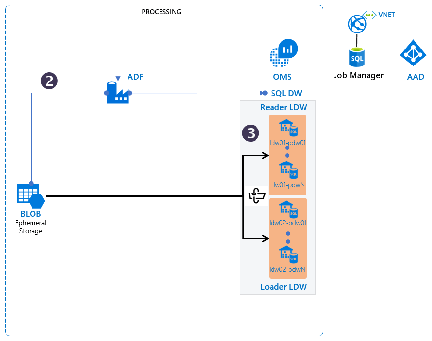

# Configuring Logical Data Warehouses
The TRI implements data load orchestration into multiple parallel data warehouses for redundancy and high availability.

## Data Availability and Orchestration features

The logical Data Warehouse architecture and orchestration address these requirements:

1. Each logical data warehouse (LDW) consists of a single physical data warehouse by default. More replicas per LDW can be configured for scalability and high availability. 
2. SQL DW data refresh cycle can be configured by the user - one option is to use 8 hours.This implies loading the physical data warehouses 3 times a day.
3. Adding new schemas and data files to the  SQL DW is a simple, scriptable process. The TRI assumes 100-500 data files being sent in every day, but this can vary day to day.
4. The job manager is both “table” aware and "data/time" aware to plan execution of a report until data has been applied representing a given period of time for that table.
5. Surrogate keys are not utilized and no surrogate key computation is applied during data upload.
6. All data files are expected to be applied using “INSERT” operations.  There is no support to upload “DELETE” datasets.  Datasets must be deleted by hand; no special accommodation is made in the architecture for DELETE or UPDATE.
7. All fact tables in the data warehouse (and the DIMENSION_HISTORY) tables are expected to follow the Kimball [Additive Accumulating Snapshot Fact Table](http://www.kimballgroup.com/2008/11/fact-tables/) approach.  A “reversal flag” approach is recommended, to indicate if a fact is to be removed, with offsetting numeric values.  For example, a cancelled order is stored with value of $100 on day 1 and reversal flag set to false; and stored with a value of -$100 on day 2 with a reversal flag set to true.
8.	All fact tables will have DW_ARCHIVAL_DATE column set so that out-of-time analysis and aggregation can be performed.  The values for the DW_ARCHIVAL_DATE will be set by the Data Generator that computes the change set for the LDW each local-timezone day.
9.	The job manager does not prioritize data loads, and provides only a minimal dependency tracking for golden dimensions and aggregates. “Golden Dimensions” are tables that must be loaded before other tables (dimension, fact or aggregate) into the physical EDWs.
10.	Dimension tables must be re-calculated and refreshed after every load of a dimension table with >0 records.  A stored procedure to re-create the current dimension table after a load of dimension table history records is sufficient.
11.	The Admin GUI provides DW load status.
12. Data availability can be controlled using manual overrides.

## Relationship with Tabular Models

The TRI also meets the following requirements for the tabular model generation in relation to the SQL DW:

1.	An optional stored procedure runs on tables to produce aggregate results after a load.  The aggregate tables will also be tracked in the job manager. A set of tabular model caches will be refreshed with the results of the incremental dataset changes.  
2.	Tabular model refreshes do not need to be applied synchronously with the logical data warehouse flip; however, there will be minimal (data volume dependent) delay between the tabular model refresh and the application of updates as viewed by a customer.
3.	Dependencies from the tabular model caches will be known to the Job Manager. Only the tabular model caches that are impacted by a dataset change will get re-evaluated and their read-only instances updated.
4.	The system is designed to refresh 10-100 tabular model caches 3 times daily, with each tabular model having size approximately 10Gb of data.

## Logical Data Warehouse Status and Availability
A set of control tables associate physical DWs to tables, schemas, and to time ranges and record dataset auditing information (start date, end date, row count, filesize, checksum) in a separate audit file.

The LDW load and read data sets iterate through three states:
- `Load`: The LDW set is processing uploaded data files to "catch-up" to the latest and greatest data.
- `Standby`:The LDW is not processing updates nor serving customers; it is a hot-standby with “best available” data staleness for disaster recovery purposes.
- `Active`: The LDW is up-to-date and serving requests but not receiving any additional data loads.

It is recommended that the data files that are loaded into physical DW instances have the following naming structure:

- Data File: `startdatetime-enddatetime-schema.tablename.data.csv`
- Audit file: `startdatetime-enddatetime-schema.tablename.data.audit.json`

This will provide sufficient information to determine the intent of the file should it appear outside of the expected system paths.  The purpose of the audit file is to contain the rowcount, start/end date, filesize and checksum.  Audit files must appear next to their data files in the same working directory always.  Orphaned data or audit files should not be loaded.

> To gain a deeper understanding of the flip process, please read [Anatomy of a Logical Data Warehouse Flip](./5-Understanding%20data%20warehouse%20flip.md).
