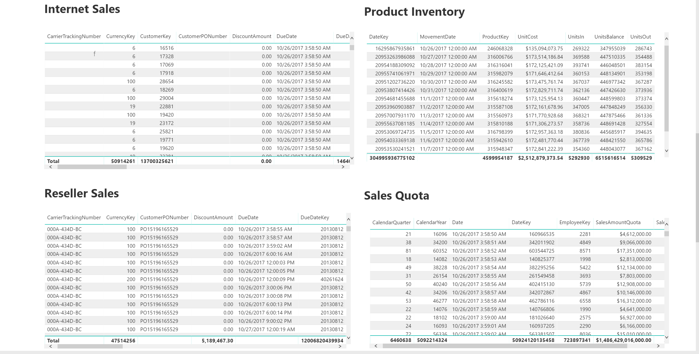
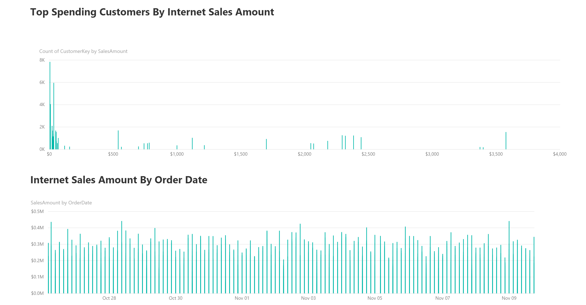
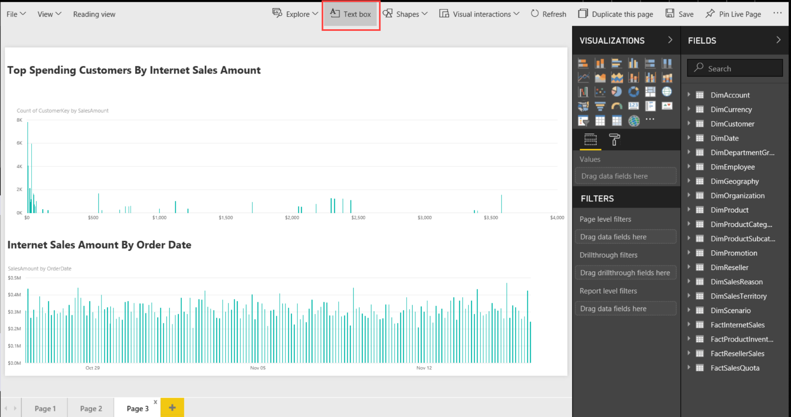

# Create Dashboard using PowerBI Online

## Configure datasources

You are now ready to create a dashboard using the data in your deployment. The first thing to do is browse to  [PowerBI Online](https://powerbi.microsoft.com) and sign in. Then, click **settings** at the top and select **Manage gateways**. Click the gateway you just created the click **Add data sources to use the gateway**. Next, enter a new data source name and select **Analysis Services** for the type. For **Server** enter the SSAS load balancer's IP address. You can find this the same way you found the SQL Server VM's IP address, except this time scroll down to the load balancers and click the one ending in "ssasrolb" and clicking **Frontend IP configuration**. For **database** enter **AdventureWorks** (unless you've reconfigured your own database). For **Username** and **Password** enter the values you chose for your deployment.

> Note: **Username** here also requires the domain name which you specified during the deployment. So, **Username** should look like `DomainName\Username`.

When ready, click **Add**.

## Add users to the datasource

Next, click **Users** and add all the people who can publish reports using this datasource by entering their email addresses and clicking **Add**. The email you entered in setting up the on-premises PowerBI data gateway is already used by default.

When ready, click **Map user names**. Enter the **Original name** (the user's email address) and the **New name** (the domain joined username from above) for all users. This will create mappings for each user's email id to the domain joined username for the SSAS Read Only VMs. Click [here](https://powerbi.microsoft.com/en-us/documentation/powerbi-gateway-enterprise-manage-ssas/#usernames-with-analysis-services) to learn more about usernames with Analysis Services.

When ready, click **OK**. You may need to wait a few minutes for the changes to take affect.

## Create an app workspace

Next create a workspace. To do this, click **Workspaces** > **Create app workspace** and type a name for your workspace. If needed, edit it to be unique. You have a few options to set. If you choose Public, anyone in your organization can see what's in the workspace. Private means that only members of the workspace can see its contents.

> Note: You cannot change the Public/Private setting after you've created the workspace.

You can also choose if members can edit or have view-only access. Add email addresses of people you want to have access to the workspace, and click **Add**. You cannot add group aliases, only individuals. Decide whether each person is a member or an admin.

> Note: Admins can edit the workspace itself, including adding other members. Members can edit the content in the workspace unless they have view-only access.

When ready, click **save**.

## Create a dataset

Now you are ready to create a report. Begin by clicking **Get Data**. Under **Databases** click **Get** > **SQL Server Analysis Services** > **Connect**. Scroll down and click on your newly created gateway. Click **AdventureWorks - Model** > **Connect**.

> TIP: You may have to refresh your browser to see your new dataset.

## Create reports and dashboards

Under **Datasets**, click your new dataset. You can create whatever kind of report you want, but below are the steps for creating a three tabbed report showing some interesting data visualizations.

### Tab One - Percentage of sales contributed by each individual customer

Under **Visualizations** select **Pie chart**. Under **Fields** expand **FactInternetSales** and drag **SalesAmount** into **Legend** and **CustomerKey** into **Values**. Under **Filters** select **SalesAmount**, enter **greater than 250000**, and click **Apply filter**.

Under **Visualizations** select **TreeMap**. Under **Fields** expand **FactInternetSales** and drag **SalesAmount** into **Values** and **OrderDate** into **Group**. Under **Filters** select **SalesAmount**, enter **greater than 250000**, and click **Apply filter**.

- Dashboard
	  

### Tab Two - Underlying Fact tables

Create a new tab. Under **Visualizations** click **Table**. Under **Fields** expand **FactInternetSales** and check all the fields. Click **Table** again, expand **FactProductInventory**, and check all fields. Click **Table** again, expand **FactResellerSales**, and check all fields. Click **Table** again, expand **FactSalesQuota**, and check all fields.
- Dashboard  
	
        
        
### Tab Three - Sales summary for top spending customers and sales amount ordered by date

Create a new tab. Under **Visualizations** click **Clustered column chart**. Under **Fields** expand **FactInternetSales** and drag **SalesAmount** to **Axis** and **CustomerKey** to **Value**. Click **CustomerKey** and select **Count (Distinct)**.

Under **Visualizations** select **Stacked column chart**. Under **Fields** expand **FactInternetSales** and drag **SalesAmount** to **Value** and **OrderDate** to **Axis**.  
- Dashboard  
	  

When ready, click **Save this report**, enter a name for your report, and click **Save**.

**NOTE: You can click “Text box” to add custom titles to all your report visualizations.**   
  

## Publish app

For your new workspace, click **Publish app** in the upper right to start the process of sharing all the content in that workspace. First, for **Details**, fill in the description to help people find the app. You can set a background color to personalize it. Next, for **Content**, you see the content that’s going to be published as part of the app – everything that’s in the workspace. You can also set the landing page (the dashboard or report people will see first when they go to your app) or none (in which case they’ll land on a list of all the content in the app). Last, for **Access**, decide who has access to the app: either everyone in your organization, or specific people or email distribution lists.  
