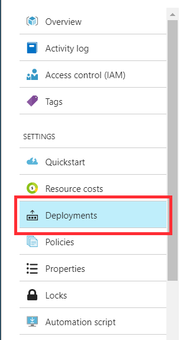
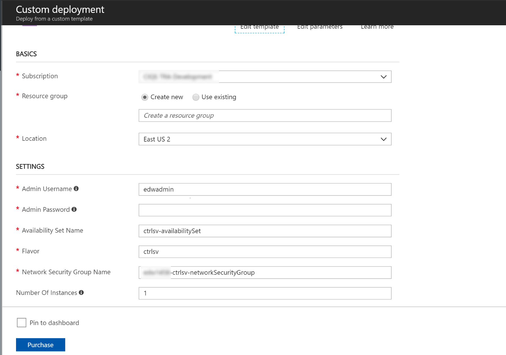

# Restart a Failed Control Server
The Control Server as the brain box of the entire system is still susceptible to failure. The following steps describes how to re-deploy a failed Control Server.

#### Restart Control Server Deployment
1. Take a note of your resource group name. 

2. Login to [Azure Portal](https://portal.azure.com)

3. Locate your resource group

4. Open the **Deployments** tab under your resource group.    
    	
5. Click on **deployVMCtrlsv**  
	
6. Click on **Redeploy** to re-provision the Control Server VM      
	
7. This opens the **Custom Deployment**    
	
8. Ensure the following are fulfilled:
	- Use your existing resource group
	- Ensure all the settings are the same as your previous deployment. 
8. Click on the **Purchase** button to deploy the virtual machine again. 
