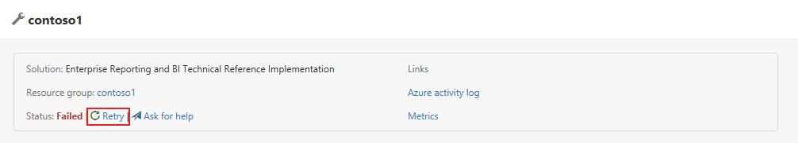

# Troubleshooting the Deployment

Even if everything is setup properly, it is still possible for the deployment to fail. Please consult the troubleshooting steps below, for some known possible failures. 

## Generic Failure

Although the deployment is completely automated, some deployment steps will encounter intermittent failures, or may appear to be spinning on a specific step for a long time.

As a first step, refresh the web page. If the dashboard has timed you out, log back in. If the ensuing screen shows an error on a particular step, simply click the **retry** button at the top of your deployment page. After one retry the failed activity should successfully complete. If the activity still fails on retry, please consult the other troubleshooting sections.

## CustomScriptExtension Failure

Custom script extensions may fail intermittently. In this scenario, the **retry** button will not work without first deleting the custom script extension from the VM which runs the script. 

### Retry steps:
1. Find your deployment resource group in the [Azure portal](https://portal.azure.com) 
2. Click the `Deployments` blade. This will show you the failed deployment.
3. Click the *failed* `Deployment Name`.
4. Scroll down to the `Operation details` section and click the failed `Resource`.
5. In the `Operation details` blade find the `RESOURCE`. This resource will be of the format `<VM name>/<custom script extension name>`. Make note of this resource.
6. Search for the `VM Name` in the Azure portal search box and click the Virtual Machine link.
7. Click the `Extensions` blade of the Virtual Machine page.
8. Locate the extension with `Type` of `Microsoft.Compute.CustomScriptExtension`.
9. Click the `...` and then `Uninstall`
10. Wait for the uninstall to complete. This will take a minute or two.
11. After the uninstall has completed, click the `Retry` button on the [deployments](https://start.cortanaintelligence.com/Deployments) page.
