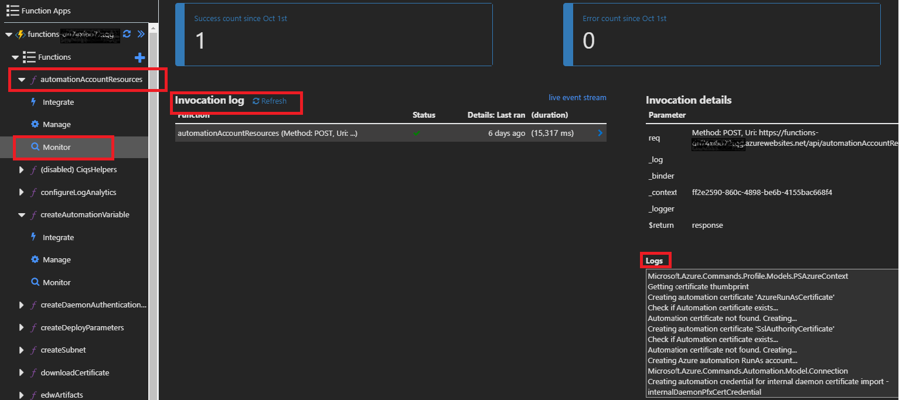

# Troubleshooting the Deployment

Even if everything is setup properly, it is still possible for the deployment to fail. Please consult the troubleshooting steps below, for some known possible failures. 

## Generic Failure

Although the deployment is completely automated, some deployment steps will encounter intermittent failures. As a first line of attack, it's best to simply click the **retry** button a the top of your deployment page. After one retry the failed activity should successfully complete. If the activity still fails on retry, please consult the other troubleshooting sections.

## CustomScriptExtension Failure

Custom script extensions may fail intermittently. In this scenario, the **retry** button will not work without first deleting the custom script extension from the VM which runs the script. 

#### Retry steps:
1. Find your deployment resource group in the [Azure portal](https://portal.azure.com) 
2. Click the `Deployments` blade. This will show you the failed deployment (if you do not see a failed deployment, this could be due to the failure in an Azure function, see steps below for [Azure Function failures](#azure-function-failure)).
3. Click the *failed* `Deployment Name`.
4. Scroll down to the `Operation details` section and click the failed `Resource`.
5. In the `Operation details` blade find the `RESOURCE`. This resource will be of the format `<VM name>/<custom script extension name>`. Make note of this resource.
6. Search for the `VM Name` in the Azure portal search box and click the Virtual Machine link.
7. Click the `Extensions` blade of the Virtual Machine page.
8. Locate the extension with `Type` of `Microsoft.Compute.CustomScriptExtension`.
9. Click the `...` and then `Uninstall`
10. Wait fo the uninstall to complete. This will take a minute or two.
11. After the uninstall has completed, click the `Retry` button on the [deployments](https://start.cortanaintelligence.com/Deployments) page.

## Azure Function Failure
Azure Functions are used to execute complex deployment steps that cannot be accomplished via ARM deployments. If retrying the deployment using the **retry** button does not work, please follow these steps to investigate the deployment failure.

1. Find your deployment resource group in the [Azure portal](https://portal.azure.com) and click the `Deployments` blade. If you see a failed deployment, do not proceed to the next step since it is not a failure in an Azure Function.
3. Go to your deployment resource group and click on the `Overview` blade. Then type 'functions-'  in the search text box which should filter it down to the Azure Functions resource that hosts various deployment steps. Click on that Azure function resource to open it.
4. Under Functions, look for the function name that correlates somewhat to the step that failed. Alternately, you can click through each function. Click on the `Monitor` tab and examine failures in the Invocation log. Examine failures in the `Invocation log` by examining the `log`. Further investigation of the failure is required to root cause the problem. More often than not, the issue may related to the specific subscription.

