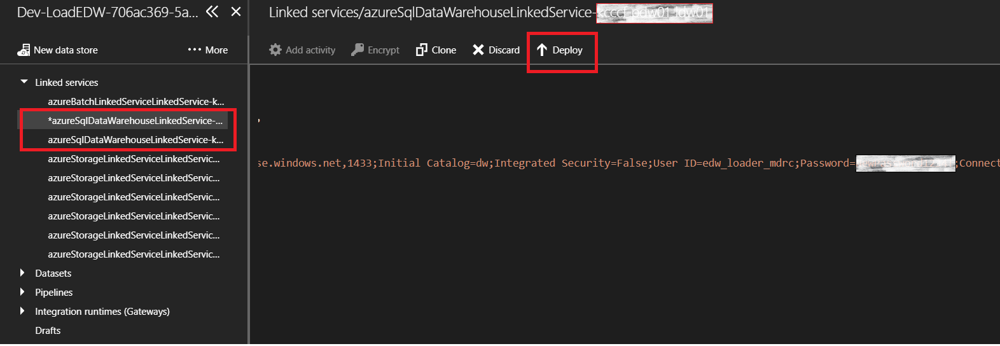

# Manage the Deployed Infrastructure

## Summary
Once the deployment is successfully completed, you will find information about how to manage the deployment and change some key properties of your deployment.

# Table of Contents
1. [Change key properties of the deployment](#change-key-properties-of-the-deployment)
2. [Change the password to the data warehouse user account](#change-the-password-to-the-data-warehouse-user-account)
3. [Add more virtual machines to your SSRS scale-out set](#add-more-virtual-machines-to-your-ssrs-scale-out-set)
4. [Add more virtual machines to your SSAS Read-Only scale-out set](#add-more-virtual-machines-to-your-ssas-read-only-scale-out-set)
5. [Add more virtual machines to your SSAS Direct-Query scale-out set](#add-more-virtual-machines-to-your-ssas-direct-query-scale-out-set)

### **Change key properties of the deployment**

The following data-driven values are tracked in the dbo.ControlServerProperties table in the Job Manager database (search for ControlServerDB in resources under your resource group) and can be edited to change the desired setting:
1. `ComputeUnits_Active` and `ComputeUnits_Load`:
These two properties track the data warehouse compute units for the data warehouse that is in the active or load state respectively. Please exercise caution and pick an [allowable value](https://azure.microsoft.com/en-us/pricing/details/sql-data-warehouse/elasticity/) while also considering the pricing for the desired values. If the value is not allowed, it will be ignored in favor of a safe default which will not help you achieve the desired scale.

2. `FlipInterval`: This number stands for the number of hours after which we will attempt to flip the state of the logical data warehouses (along with the physical data warehouses under it) from `Active` to `Load`. The exact flip event times are visible in the Admin UI as well as the dbo.DWStateHistories table in the Job Manager database.

3. `MinDQNodesNotInTransitionStateDuringFlip`: This number specifies the minimum number of Direct Query nodes in an `Analysis Services Direct Query (ASDQ)` group that should be in normal state serving queries during any flip operation. During any flip operation check for a direct query node, it is checked whether there are {`MinDQNodesNotInTransitionStateDuringFlip`} number of direct query nodes in normal state. If not then the node is not flipped and it awaits for the condition to be satisfied before flip can happen. If there in only a single node in an `ASDQ` group then this condition is ignored. This must be a positive integer that must not exceed the total number of Direct Query nodes in an `ASDQ` Group.

4. `MinSSASROServersNotInTransition`: This is the minimum number of Read Only nodes that should be in Active state at any time. This must be a positive integer that must not exceed the total number of Read-Only nodes.

5. `MinsAliasNodeDaemonGraceTime`: Time in minutes that a Direct Query node is given to drain existing connections during a flip operaton. The connection string to the physical datawarehouse is switched after {`MinsAliasNodeDaemonGraceTime`} minutes from the start of the flip operation initiation for the node.

6. `MinsToWaitBeforeKillingAliasNodeDaemonGraceTime`: In case a Direct Query node does not respond back after `MinsAliasNodeDaemonGraceTime` minutes signalling the completion of its connection string switch (in case the node goes down), a sweeper job changes the state of the Direct Query node to `ChangeCompleted` after waiting for another  {`MinsToWaitBeforeKillingAliasNodeDaemonGraceTime`} minutes and unblocks the flip operation. When the node comes back up, it polls its new connection string from Control Server and is ready to serve requests.

7. `BatchUriLinkedService`: The uri to the batch linked service.

### **Change the password to the data warehouse user account**
Access to the data warehouses is controlled by sql logins. The passwords for these logins are managed in the key vault as the central authority. However, the password is also cached in other entities which makes it tricky to change the password for the sql logins, while ensuring seamless execution of the data flow. Following is the places where you must change the password:

1. SQL Data Warehouse

    All the Azure SQL data warehouses must maintain the same password for any given user login. This is required since the SSAS Direct Query nodes issue queries using the same credentials.

2. Key vault

    All clients that access the database retrieve the password from key vault. The passwords are stored as secrets. You will need to grant your account the right access policies in order to view and edit the secrets.

    **How to grant access to a user to view and edit the secrets**

    1. Find the key vault resource using the search term 'keyvault' in your resource group.
    2. Click on the `Access policies` blade and click `Add new`.
    3. Click `Select principal` and find your user account and click `Select`.
    4. For `Secret permissions`, grant yourself permissions to `Get`, `Set` and `List` under `Secret Management Operations`.
    5. Then press `OK` and `Save` again to save your changes.

    **How to change the password for the sql login stored as a secret in the Key Vault**

    1. Find the key vault resource using the search term 'keyvault' in your resource group.
    2. Select `Secrets` under `SETTINGS` and find the name of the secret (usually ends in 'Password').
    3. Click `New Version` in the following screen and `Manual` as `Upload options`. Supply the new password and click `Create`.

3. Linked Services in the Azure Data Factory

    Your resource group will have an Azure Data Factory that has linked services. There will be one linked service for each physical data warehouse. You will need to update the linked service after changing the password on the data warehouse since the linked services are not refreshed after creation.

    How to change the password for a linked service:

    1. Find the Azure Data Factory resource using the search term 'LoadEDW' in your resource group.
    2. Click on `Author and deploy` that will open the Azure Data Factory in an editable mode.
    3. Expand on `Linked services` and find **all** the linked services that begin with 'azureSqlDataWarehouseLinkedService'. There should be one linked service per data warehouse. Edit the password field and click `Deploy`.

    

4. Connection on the SSAS Direct-Query nodes

    You can connect to the SSAS server on the SSAS Direct-Query virtual machines (SSAS Direct-Query nodes can be found by searching for resources using the search term 'ssasdq' in your resource group) and view the connections under each Analysis Services database. These connections point to individual physical data warehouses and the passwords are cached until the next data warehouse flip event is triggered. Edit the connection and change the password to ensure that the queries from the SSAS Direct-Query nodes to the data warehouses do not fail during this time.

### **Add more virtual machines to your SSRS scale-out set**

You can add new virtual machines of type SSRS if you want to want to scale-out your SSRS nodes.

1.  Add SSRS virtual machines:
    1. Find your deployment resource group in the [Azure portal](https://portal.azure.com).
    2. Add new VMs as needed along with network interfaces and join the VM to your Azure AD domain, [install the OMS extension](https://docs.microsoft.com/en-us/azure/virtual-machines/windows/extensions-oms) to enable monitoring and join the virtual machine to the SSRS availability set. Alternately, you can search for the deployment (called 'deployVMSSRS') from the deployments in your resource group  and redeploy the additional VMs by simply increasing the number of instances.

2. Register DSC on the new virtual machines:
    1. Find your resource by searching for 'automationAccount' in your resource group.
    2. Under `Configuration Management`, click on `DSC Nodes` and add your new Azure VM and connect it to the 'DSCConfiguration.ssrs' node configuration. Choose 'ApplyAndMonitor' for the `Configuration Mode` and 'ContinueConfiguration' for the `Action after Reboot` while adding the node. Once the node is added, you will be able to find it listed under `DSC Nodes`.

3. Add the virtual machine to the SSRS scale-out set:

    This step will require you to download a custom script extension (ConfigureSSRS-CSE.ps1) which can be found in the 'ssrs' container in the artifacts storage account (search for 'edwartifacts' under your resource group) and use the default parameter set ('NonPrimarySSRS') since you are adding the VM to an existing scale-out set.

### **Add more virtual machines to your SSAS Read-Only scale-out set**

You can add new virtual machines of type SSAS Read-Only if you want to want to scale-out your SSAS Read-Only nodes.

1.  Add SSAS Read-Only virtual machines:
    1. Find your deployment resource group in the [Azure portal](https://portal.azure.com).
    2. Add new VMs as needed along with network interfaces and join the VM to your Azure AD domain, [install the OMS extension](https://docs.microsoft.com/en-us/azure/virtual-machines/windows/extensions-oms) to enable monitoring and join the virtual machine to the SSAS Read-Only availability set. Alternately, you can search for the deployment (called 'deployVMSSASRo') from the deployments in your resource group  and redeploy the additional VMs by simply increasing the number of instances.

2. Register DSC on the new virtual machines:
    1. Find your resource by searching for 'automationAccount' in your resource group.
    2. Under `Configuration Management`, click on `DSC Nodes` and add your new Azure VM and connect it to the 'DSCConfiguration.ssasro' node configuration. Choose 'ApplyAndMonitor' for the `Configuration Mode` and 'ContinueConfiguration' for the `Action after Reboot` while adding the node. Once the node is added, you will be able to find it listed under `DSC Nodes`.

3. Populate the dbo.TabularModelNodeAssignments table in the Job Manager database (search for 'ControlServerDB' in the resources under your resource group). The data values depend on the Analysis Services tables that you intend to populate on the SSAS Read-Only virtual machine. You can examine the existing entries corresponding to existing nodes in this table for suitable examples. In order to catch up with the other Read-Only nodes, we recommend restoring backups of the databases from those nodes onto your newly added node.

### **Add more virtual machines to your SSAS Direct-Query scale-out set**

You can add new virtual machines of type SSAS Direct-Query if you want to want to scale-out your SSAS Direct-Query nodes.

1.  Add SSAS Direct-Query virtual machines:
    1. Find your deployment resource group in the [Azure portal](https://portal.azure.com).
    2. Add new VMs as needed along with network interfaces and join the VM to your Azure AD domain, [install the OMS extension](https://docs.microsoft.com/en-us/azure/virtual-machines/windows/extensions-oms) to enable monitoring and join the virtual machine to the SSAS Direct-Query availability set. Alternately, you can search for the deployment (called 'deployVMSSASDq') from the deployments in your resource group  and redeploy the additional VMs by simply increasing the number of instances.

2. Register DSC on the new virtual machines:
    1. Find your resource by searching for 'automationAccount' in your resource group.
    2. Under `Configuration Management`, click on `DSC Nodes` and add your new Azure VM and connect it to the 'DSCConfiguration.ssasdq' node configuration. Choose 'ApplyAndMonitor' for the `Configuration Mode` and 'ContinueConfiguration' for the `Action after Reboot` while adding the node. Once the node is added, you will be able to find it listed under `DSC Nodes`.

3. Populate the dbo.PDWAliasNodeStates table in the Job Manager database (search for 'ControlServerDB' in the resources under your resource group). You can examine the existing rows in this table for suitable examples. Pick an AliasName from the current set of aliases. In order to equally distribute the load among the physical data warehouses, we recommend that you target for an even distribution of aliases between the rows in this table to the extent possible.
