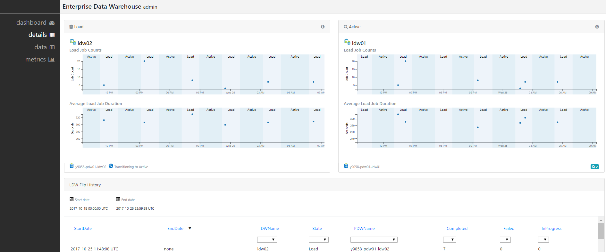

# Overview

The Admin UI provides a graphical interface for performing several functions pertaining to your Enterprise Reporting and BI Technical Refererence Implementation, including:

- Monitoring the health of the overall system and each deployed resource
- Understanding the flow of data through the various component layers
- Seeing the state, active or load, of each SQL Data Warehouse over time
- Seeing the number of load jobs and average latency per SQL Data Warehouse over time
- Drilling down to see the individual status of table load jobs
- Viewing the various system configuration settings
- Detailed monitoring of several components using pre-built Operations Management Suite (OMS) dashboards  

# How to get to it

The Admin UI is automatically installed as part of your solution, and you will be provided a link to it on the last page of your deployment that looks something like this: https://rbaedw56y9058.adminui.ciqsedw.ms. Note that the naming convention is as follows: https://<your solution name><unique string>.adminui.<your domain name>, where the solution name is the name you provided at the beginning of the deployment. This name is also the name of the resource group holding all of the resources for the deployment in your subscription.

By clicking this link, you will open a browser showing the Admin UI.

# Usage

The Admin UI consists of four tabs - overview, details, data, and metrics. Below is a description of each one of the tabs:

## Overview

The overview tab shows the flow of data through the different component layers of the system, starting from the originating data source, to data ingestion, persistence, reporting, and ultimately consumption. All the boxes correspond to a resource deployed in Azure, except for the data source, which can be configured to be running on-premises.

The Data Sources box contains by default a link to the Azure VM hosting the data generator.

The Control Server box contains a link to the Azure VM hosting the Control Server.

The Azure Data Factory box contains a link to the Azure Data Factory (ADF). From there, you can see the various configured linked services and the one time pipelines created for loading data from the data source into the SQL Data Warehouses and Azure blob storage. In the box you will also see the number of successful, in progress, waiting, and failed load jobs.

There are two Logical DW boxes, one for the SQL Data Warehouses in the load state, and one for SQL Data Warehouses in the active state. Each box contains a link to the Azure SQL Server containing the SQL Data Warehouses. In the box you will also see a health check indicator of the SQL Data Warehouse.

The SSAS DQ box contains links to each of the Azure VMs hosting a SSAS Direct Query (DQ) node. In the box you will also see the last time that it flipped.

The SSAS PB box contains links to each of the Azure VMs hosting a SSAS Partition Builder (PB) node. In the box you will also see the number of tabular models ready, updating, or pending.

The SSAS RO box contains links to each of the Azure VMs hosting a SSAS Read Only (RO) node. In the box you will also see if the partition is up to date.

The SSRS box contains links to each of the Azure VMs hosting a SSRS node.

Finally, the PBI Gateway box indicates the PBI Gateway enabling Power BI (PBI) reports.

## Details

The details tab shows at the top two tiles for the two logical data warehouses in the system. Each tile contains two time series graphs grouped by the state, active or load, of the logical data warehouse. The first graph shows the total job count for each state. The second graph shows the average job duration for each state. Each tile also shows the name of the associated SQL Server and the number of attached Direct Query nodes.

Below this is a table showing similar information, but in tabular format. Each row shows the start and stop times for a particular SQL Data Warehouse state, and additional information such as the number of completed, failed, and in progress jobs. You can click on a row to open a new tab that drills down into that particular time range, showing the individual jobs for each table.

## Data

The data tab lets your view the underying settings of the system, including DWTables, ControlServerProperties, StoredProcedures, TabularModelTablePartitions, and TabularModelNodeAssignments.

## Metrics

The metrics tab contains links to several pre-built Operations Management Suite (OMS) dashboards, including the Control Server, Partition Builder Nodes, Direct Query Nodes, Read Only Nodes, SQL Server Usage, and Azure Storage Analytics. By clicking a link, you will be taken to one of these dashboards, allowing you to see in greater detail information about that component of the system.

# Troubleshooting

If you run into trouble where, for example, page content is not showing properly, often times it is because you are not connected to your VPN. The Admin UI is hosted on a web server hosted on Azure in a private network, and without being connected to your VPN, your browser will not be able to resolve the DNS name. Please check that you are connected to your VPN, and if not, connect and reload the Admin UI.

If this is not the issue, then your best bet is to open the debugging console in your browser and view the console output. Typically this is done in your browser by clicking Function F12 and clicking "Console".
