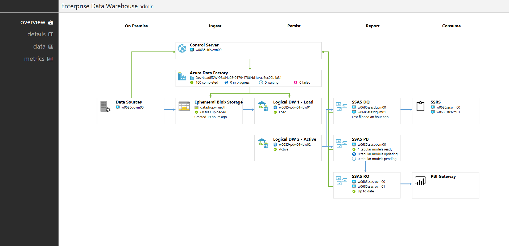
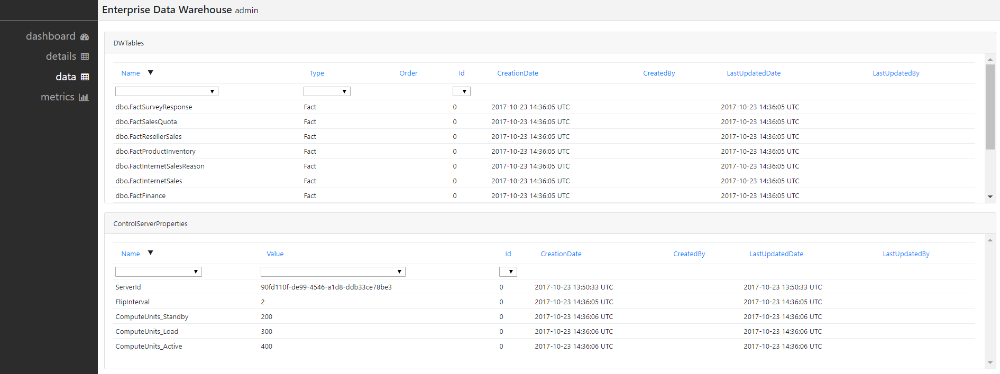
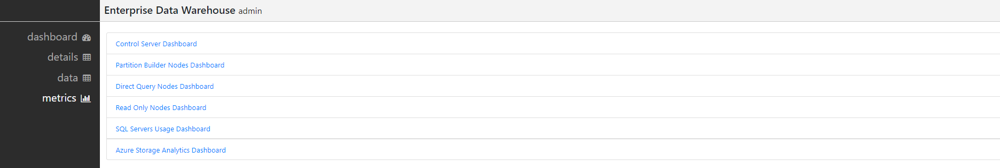

# Overview

The Admin UI provides a graphical interface for performing several functions pertaining to your Enterprise Reporting and BI Technical Reference Implementation, including:

- Monitoring the health of the overall system and each deployed resource
- Understanding the flow of data through the various component layers
- Seeing the state, active or load, of each SQL Data Warehouse over time
- Seeing the number of load jobs and average latency per SQL Data Warehouse over time
- Drilling down to see the individual status of table load jobs
- Viewing the various system configuration settings
- Detailed monitoring of several components using pre-built Operations Management Suite (OMS) dashboards  

# How to access the Admin UI

The Admin UI is automatically installed as part of your solution deployment. The web page announcing the successful completion of your deployment will have a link to the Admin GUI (Example: https://rbaedw56y9058.adminui.ciqsedw.ms). The link's naming convention is as follows: `https://<your-deployment><unique-hash>.adminui.<your-domain>`, where `your-deployment` is the name you provided at the beginning of the deployment. This name is also the name of the resource group holding all of the resources for the deployment in your subscription.

>Before you click on the Admin link, please check that you are connected to your Virtual Private Network (VPN). The Admin UI is hosted on a web server in Azure that is not accessible over the open Internet. Until you connect your local computer to your Azure VPN, your browser will not be able to resolve the DNS name. Refer to the [VPN installation guide](./6-Prepare%20the%20infrastructure%20for%20your%20Data.md#1-install-vpn-client) and the general [point-to-site documentation](https://docs.microsoft.com/en-us/azure/vpn-gateway/vpn-gateway-howto-point-to-site-resource-manager-portal) for help connecting to your VPN.

# Usage

The Admin UI consists of four tabs - **overview**, **details**, **data**, and **metrics**. Below is a description of each one of the tabs:

## Overview

The overview tab shows a diagram depicting the flow of data through the different component layers of the system, starting from the originating data source, to data ingestion, persistence, reporting, and ultimately consumption. All the boxes in the diagram correspond to a resource deployed in Azure, except for the data source, which can be configured to be running on-premises.

| Diagram Box | Description |
| ---------- | ----------- |
| Data Sources | links to the Azure VM hosting the data generator |
| Control Server | links to the Azure VM hosting the Control Server |
| Azure Data Factory | links to the Azure Data Factory (ADF). From there, you can see the various configured linked services and the one-time pipelines created for loading data from the data source into the SQL Data Warehouses and Azure blob storage. In this box, you will also see the number of `successful`, `in progress`, `waiting`, and `failed` load jobs. |
| Logical Data Warehouse (2) | one box represents the SQL Data Warehouses in the `load` state, and the others are for SQL Data Warehouses in the `active` state. Each links to the Azure resource denoting the SQL Data Warehouses. In this box, you will also see a health check indicator of the SQL Data Warehouse. |
| SSAS DQ | contains links to each of the Azure VMs hosting a SSAS Direct Query (DQ) node. In this box, you will see the last timestamp when this node flipped to the Active Reader SQL Data Warehouse. |
| SSAS Partition Builder | links to each of the Azure VMs hosting a SSAS Partition Builder (PB) node. In this box, you will also see the number of tabular models ready, updating, or pending. |
| SSAS ReadOnly | links to each of the Azure VMs hosting a SSAS Read Only (RO) nodes. In this box, you will also see if the partition is up to date. |
| SSRS | links to each of the Azure VMs hosting a SSRS node |
| PBI Gateway | indicates the PBI Gateway enabling Power BI (PBI) reports |

## Details

The details tab shows at the top two tiles for the two logical data warehouses in the system. Each tile contains two time-series graphs grouped by the state, `active` or `load`, of the logical data warehouse. The first graph shows the `total job count` for each state. The second graph shows the `average job duration` for each state. Each tile also shows the name of the associated SQL Server and the number of attached Direct Query nodes.

Below this is a table showing similar information, but in tabular format. Each row shows the `start` and `stop` times for a particular SQL Data Warehouse state, and additional information such as the number of `completed`, `failed`, and `in progress` jobs. You can click on a row to open a new tab that drills down into that particular time range, showing the individual jobs for each table.

## Data

The data tab shows the underlying settings of the system, including _DWTables_, _ControlServerProperties_, _StoredProcedures_, _TabularModelTablePartitions_, and _TabularModelNodeAssignments_.

## Metrics

The metrics tab contains links to several pre-built Operations Management Suite (OMS) dashboards, including the Control Server, Partition Builder Nodes, Direct Query Nodes, Read Only Nodes, SQL Server Usage, and Azure Storage Analytics. By clicking a link, you will be taken to one of these dashboards, allowing you to see in greater detail information about that component of the system.

# Troubleshooting

If you are unable to view any content on the Admin UI, and you have verified VPN connectivity, then open a debugging console in your browser and view the console output. Typically this is done in your browser by clicking Function F12 and clicking "Console". Refer to the [FAQ](./16-Frequently%20Asked%20Questions.md), and if there is no solution available there, refer [Help and Support](./17-Get%20Help%20and%20Support.md).
