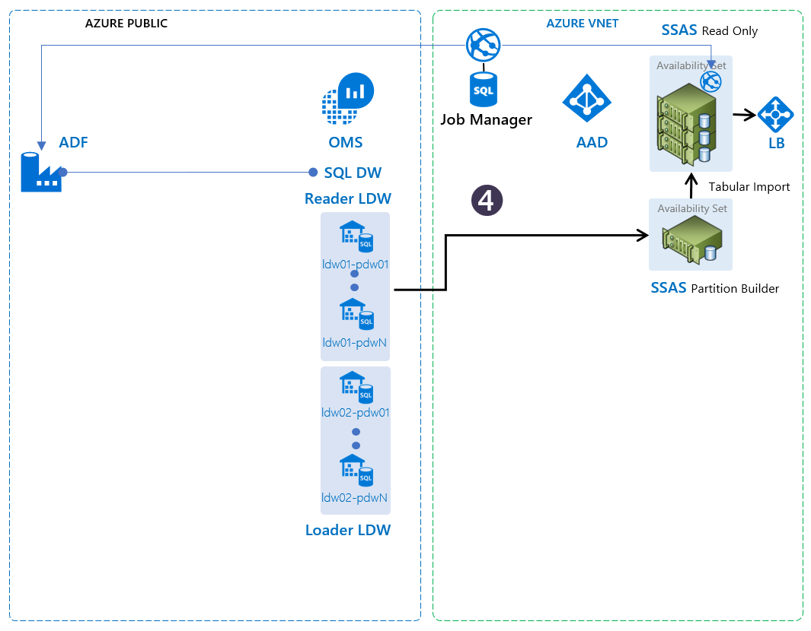

# Analysis Services for Interactive BI

The TRI helps you operationalize and manage tabular models in Analysis Services (AS) for interactive BI. The read-only AS servers are configured to handle interactive BI query load from client connections via a frontend load balancer. Analysis Services, tabular models, and their characteristics are explained [here]((https://docs.microsoft.com/en-us/sql/analysis-services/tabular-models/tabular-models-ssas))

The SSAS Model Cache in this TRI consists of six components - their roles described in the [architectural overview] (..\CiqsInstaller\CiqsInstaller\core\HomePage.md)
- Tabular Models
- SSAS Partition Builder
- SSAS Read Only Cache servers
- Job Manager that coordinates the tabular model refresh
- Azure Blob that stores the tabular models for refresh
- Load Balancers that handles client connections



## Tabular Model Creation

Tabular models are Analysis Services databases that run in-memory, or act as a pass-through for backend data sources. They support cached summaries and drilldowns of large amounts of data, thanks to a columnar storage that offers 10x or more data compression. This makes them ideal for interactive BI applications. See [this article](https://docs.microsoft.com/en-us/sql/analysis-services/tabular-models/tabular-models-ssas) for more details. Typically, tabular models hold only a subset of the big data held in upstream data warehouse or data marts – in terms of the number of entities, and data size. There is a large corpus of best practices information for tabular model design and tuning, including this [excellent article](https://msdn.microsoft.com/en-us/library/dn751533.aspx) on the lifecycle of an enterprise grade tabular model.

You can use tools such as the [SSDT tabular model designer](https://docs.microsoft.com/en-us/sql/analysis-services/tabular-models/tabular-model-designer-ssas), available with Visual Studio 2015 (and later), to create your tabular models. Set the compatibility level of the tabular models at `1200` or higher (latest is `1400`, as of this writing) and the query mode to `In-Memory`. See [here](https://docs.microsoft.com/en-us/sql/analysis-services/tabular-models/tabular-model-solutions-ssas-tabular) for details on tabular model creation.

## Tabular Model Partition Processing

Partition creation is automated using the open source [AsPartitionProcessing tool](https://github.com/Microsoft/Analysis-Services/tree/master/AsPartitionProcessing). Many of the configurable options for partition building directly correspond to the configuration of this tool. Refer to AsPartitionProcessing tool's [whitepaper](https://github.com/Microsoft/Analysis-Services/blob/master/AsPartitionProcessing/Automated%20Partition%20Management%20for%20Analysis%20Services%20Tabular%20Models.pdf) for further documentation.

## Tabular model configuration for continuous incremental refresh at scale
The various orchestration components of the TRI refer to four configuration tables to enable continuous and incremental model refresh.

You can provide configuration inputs for two of these tables:

| TableName | Description |
|:----------|:------------|
|**TabularModel**|Lists tabular models with their server and database names, to be used by the daemon on the Partition Builder servers to connect to the SSAS server and the database for refresh.|
|**TabularModelTablePartitions**|This table specifies which model that a tabular model table is part of, and the source (DW) table to which a tabular model table is bound to. It also provides the column that will be used in refreshing the tabular model, and the lower and upper bounds of the data held in this tabular model. It also defines the strategy for processing the SSAS partitions.|

### TabularModel
Provide the unique &lt;_server, database_&gt; pairs in the table. This information uniquely identifies each tabular model for the Job Manager, and in turn, will be used by the daemon on the Partition Builder nodes to connect to the SSAS server and the database before refresh.

_Example_:

```json
{
    "AnalysisServicesServer":"ssaspbvm00",
    "AnalysisServicesDatabase":"AdventureWorks",
    "IntegratedAuth":true,
    "MaxParallelism":4,
    "CommitTimeout":-1
}
```

* **AnalysisServicesServer** : SSAS VM name or Azure AS URL.
* **AnalysisServicesDatabase** : Name of the database.
* **IntegratedAuth** : Boolean flag whether connection to DW to be made using integrated authentication or SQL authentication.
* **MaxParallelism** : Maximum number of threads on which to run processing commands in parallel during partition building.
* **CommitTimeout** : Cancels processing (after specified time in seconds) if write locks cannot be obtained. -1 will use the server default.

### TabularModelTablePartitions

_Example_:
```json
{
    "AnalysisServicesTable":"FactResellerSales",
    "SourceTableName":"[dbo].[FactResellerSales]",
    "SourcePartitionColumn":"OrderDate",
    "TabularModel_FK":1,
    "DWTable_FK":"dbo.FactResellerSales",
    "DefaultPartition":"FactResellerSales",
    "ProcessStrategy":"ProcessDefaultPartition",
    "MaxDate":"2156-01-01T00:00:00Z",
    "LowerBoundary":"2010-01-01T00:00:00Z",
    "UpperBoundary":"2011-12-31T23:59:59Z",
    "Granularity":"Daily",
    "NumberOfPartitionsFull":0,
    "NumberOfPartitionsForIncrementalProcess":0
}
```

* **AnalysisServicesTable** : The table to be partitioned.
* **SourceTableName** : The source table in the DW database.
* **SourcePartitionColumn** : The source column of the source table.
* **TabularModel_FK** : Foreign Key reference to the TabularModel.
* **DWTable_FK** : Foreign Key reference to the DWTable.
* **DefaultPartition** : 
* **MaxDate** : The maximum date that needs to be accounted for in the partitioning configuration.
* **LowerBoundary** : The lower boundary of the partition date range.
* **UpperBoundary** : The upper boundary of the partition date range.
* **ProcessStrategy** : Strategy used for processing the partition; "RollingWindow" or "ProcessDefaultPartition". The default partition can be specified using the "DefaultPartition" property. Otherwise assumes a "template" partition with same name as table is present.
* **Granularity** : Partition granularity of "Daily", "Monthly", or "Yearly".
* **NumberOfPartitionsFull** : Count of all partitions in the rolling window. For example, a rolling window of 10 years partitioned by month would require 120 partitions.
* **NumberOfPartitionsForIncrementalProcess** : Count of hot partitions where the data can change. For example, it may be necessary to refresh the most recent 3 months of data every day. This only applies to the most recent partitions.


Provide one of the following values for partitioning strategy in the column _PartitionStrategy_:

- _ModelProcessStrategy.ProcessDefaultPartition_ (Default)
- _ModelProcessStrategy.RollingWindow_

If you choose _ModelProcessStrategy.ProcessDefaultPartition_:

- Confirm that the tabular model contains a partition with the same name as the tabular model table. This partition is always used for the data load of the date slice, even if there are other partitions in the table.
- Provide values for _SourceTableName_ and _SourcePartitionColumn_.
- Provide values for _LowerBoundary, UpperBoundary_ to provide the start and end time span for the data in the tabular model.

If you choose _ModelProcessingStrategy.RollingWindow_:
- Confirm that the table partitions are defined on time granularity based ranges - as in Daily, Monthly or Yearly.
- Provide values for the columns _MaxDate_, _NumberOfPartitionsFull_ and _NumberOfPartitionsforIncrementalProcess_.

For both the cases, confirm that the value provided in _SourcePartitionColumn_ of the table represents a column of type DateTime in the source DW table. Tabular model refresh is incremental on time, for a specific date range.

Next, the following two tables are **read-only**. You should **not** change or update these tables or its values, but you can view them for troubleshooting and/or understanding how the model refresh happens.

| TableName | Description |
|:----------|:------------|
|**TabularModelPartitionStates**|In this table, the Job Manager tracks the source and target context for all data slices that are to be refreshed or processed in a tabular model, the start and end dates of each data slice, and the Blob URI where the processed tabular model backups will be stored.|
|**TabularModelNodeAssignments**|In this table, the partition builder tracks the refresh state of each AS Read-Only node for each tabular model. It is used to indicate the maximum date for an entity for which the data has been processed. Each of the SSAS Read-Only nodes provides its current state here - in terms of latest data by date for every entity.

### TabularModelPartitionStates

This table helps track all the data slices that are to be refreshed or processed in a tabular model. Each piece of incremental data loaded into the DW is specified with a start and end date, defining the data slice. Each new data slice will trigger a new partition to be built.

---
_Example_:
```json
{
    "ProcessStatus":"Purged",
    "TabularModelTablePartition_FK":4,
    "StartDate":"2017-09-12T18:00:00Z",
    "EndDate":"2017-09-12T21:00:00Z",
    "PartitionUri":"https://edw.blob.core.windows.net/data/AdventureWorks-backup-20170912T090408Z.abf",
    "ArchiveUri":"https://edw.blob.core.windows.net/data",
    "SourceContext":"{\"Name\":\"AzureDW\",\"Description\":\"Data source connection Azure SQL DW\",\"DataSource\":\"bd044-pdw01-ldw01.database.windows.net\",\"InitialCatalog\":\"dw\",\"ConnectionUserName\":\"username\",\"ConnectionUserPassword\":\"password\",\"ImpersonationMode\":\"ImpersonateServiceAccount\"}",
    "TargetContext":"{\"ModelConfigurationID\":1,\"AnalysisServicesServer\":\"ssaspbvm00\",\"AnalysisServicesDatabase\":\"AdventureWorks\",\"ProcessStrategy\":1,\"IntegratedAuth\":true,\"MaxParallelism\":4,\"CommitTimeout\":-1,\"InitialSetup\":false,\"IncrementalOnline\":true,\"TableConfigurations\":[{\"TableConfigurationID\":1,\"AnalysisServicesTable\":\"FactSalesQuota\",\"PartitioningConfigurations\":[{\"DWTable\":null,\"AnalysisServicesTable\":\"FactSalesQuota\",\"Granularity\":0,\"NumberOfPartitionsFull\":0,\"NumberOfPartitionsForIncrementalProcess\":0,\"MaxDate\":\"2156-01-01T00:00:00\",\"LowerBoundary\":\"2017-09-12T18:00:00\",\"UpperBoundary\":\"2017-09-12T21:00:00\",\"SourceTableName\":\"[dbo].[FactSalesQuota]\",\"SourcePartitionColumn\":\"Date\",\"TabularModel_FK\":1,\"DWTable_FK\":\"dbo.FactSalesQuota\",\"DefaultPartition\":\"FactSalesQuota\",\"Id\":4,\"CreationDate\":\"2017-09-12T17:17:28.8225494\",\"CreatedBy\":null,\"LastUpdatedDate\":\"2017-09-12T17:17:28.8225494\",\"LastUpdatedBy\":null}],\"DefaultPartitionName\":\"FactSalesQuota\"}]}"
}
```
* **ProcessStatus**: Current status of the partition being processed. _Queued_, _Dequeued_, _Ready_, or _Purged_.
* **TabularModelTablePartition_FK**: Foreign key referencing the TabularModelTablePartition.
* **StartDate**: The start date of the current refresh data slice.
* **EndDate**: The end date of the current refresh data slice.
* **PartitionUri**: Uri of the resulting partitioned backup datafile.
* **ArchiveUri**: Uri of the location to place the partitioned backup datafile.
* **SourceContext**: JSON Object specifying the source DW connection information. 
* **TargetContract**: JSON Object that maps to the AsPartitionProcessing client's "ModelConfiguration" contract.

Each row of this table represents a partition that should be built and the configuration that will be used to execute the partition builder client. Various components in the Control server can create a “work item” for the partition builder which uses the information in the attributes to process that data slice. It is evident from the fields in this table that all work items exist in the context of a _TabularModelTablePartition_ entity.

Each row contains the start and end date of the data slice. Each entity to be partitioned clearly defines a StartDate and EndDate for the date slice to be processed. Note that this date range is produced by producer of this entity. In a typical case, this represents the date range for which a tabular model needs to be refreshed – where the range is simply the date range of the data slice in a _DWTableAvailabilityRange_ entity.

#### Source context - DataSourceInfo sample contract object
Source context – indicates which data source to connect to fetch the data for the slice (i.e. all information required to connect to a DW table), and contains serialized data source (DW) connection information that the tabular model uses to update or set its connection string dynamically. This data contract directly maps to the partition processing client’s DataSourceInfo contract.

```json
{
"Name":"AzureDW",
"Description":"Data source connection Azure SQL DW",
"DataSource":"pdw01-ldw01.database.windows.net",
"InitialCatalog":"dw",
"ConnectionUserName":"username",
"ConnectionUserPassword":"password",
"ImpersonationMode":"ImpersonateServiceAccount"
}
```
#### Target context - ModelConfiguration sample contract object 
The TargetContext is a serialized representation of the ModelConfiguration contract that the partition processing client expects. It is a simplified representation of the tables and partitions that are to be processed by the client. A sample contract object is like so:

```json
{
"ModelConfigurationID":1,
"AnalysisServicesServer":"ssaspbvm00",
"AnalysisServicesDatabase":"AdventureWorks",
"ProcessStrategy":1,
"IntegratedAuth":true,
"MaxParallelism":4,
"CommitTimeout":-1,
"InitialSetup":false,
"IncrementalOnline":true,
"TableConfigurations":[
	{
	"TableConfigurationID":1,
	"AnalysisServicesTable":"FactSalesQuota",
	"PartitioningConfigurations":[
		{
		"DWTable":null,
		"AnalysisServicesTable":"FactSalesQuota",
		"Granularity":0,
		"NumberOfPartitionsFull":0,
        "NumberOfPartitionsForIncrementalProcess":0,
		"MaxDate":"2156-01-01T00:00:00",
		"LowerBoundary":"2017-09-12T18:00:00",
		"UpperBoundary":"2017-09-12T21:00:00",
		"SourceTableName":"[dbo].[FactSalesQuota]",
		"SourcePartitionColumn":"Date",
		"TabularModel_FK":1,
		"DWTable_FK":"dbo.FactSalesQuota",
		"DefaultPartition":"FactSalesQuota"
		}],
	"DefaultPartitionName":"FactSalesQuota"
	}]
}
```
### TabularModelNodeAssignment
This table contains entities that represents the refresh state of each of the supported tabular model tables per entity. The Analysis Server Read-Only nodes use this table to figure which backup file from the _TabularModelPartitionState_ entity to restore on each of the nodes. The Partition Builder node logs an entry that points to the maximum date ceiling for which data has been refreshed on a per tabular model table basis.

_example_:
```json
{
	"Name":"ssaspbvm00",
	"Type":"ASPB",
	"TabularModelTablePartition_FK":1,
	"State":"Building",
	"LatestPartitionDate":"2017-09-14T18:00:00Z"
}
```
* **Name**: The name of the virtual machine node.
* **Type**: The type of the virtual machine node. 
    * _ASRO_: SSAS Read-only
    * _ASPB_: SSAS Partition Builder
* **TabularModelTablePartition_FK**: Foreign key referencing the _TabularModelTablePartition_ table.
* **State**: Current state of the node.
    * _Normal_
    * _Transition_
    * _Building_
* **LatestPartitionDate**: Latest partition build date for the node.

---
