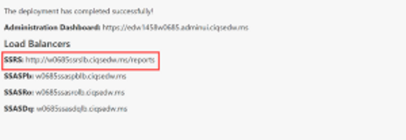
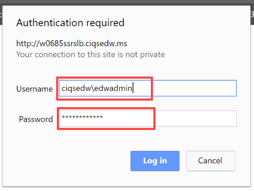
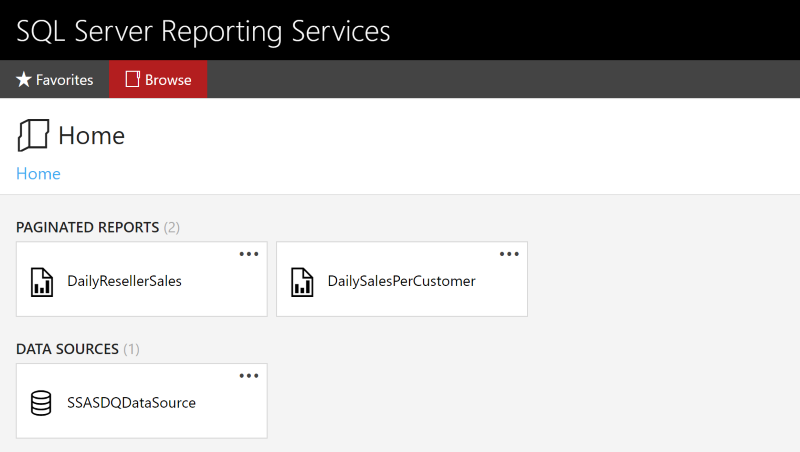
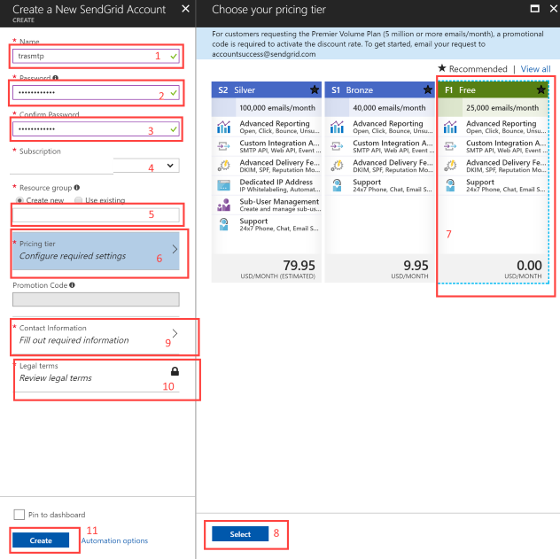
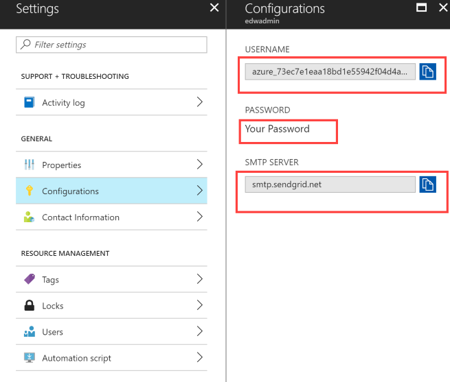
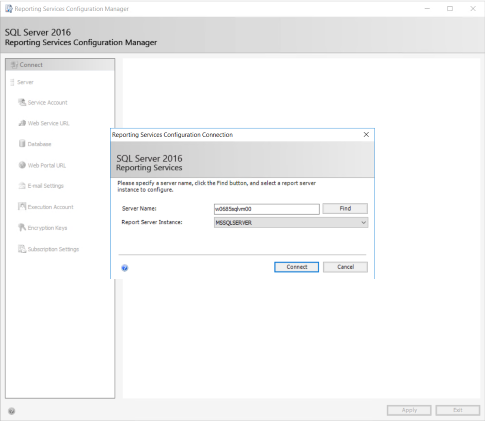
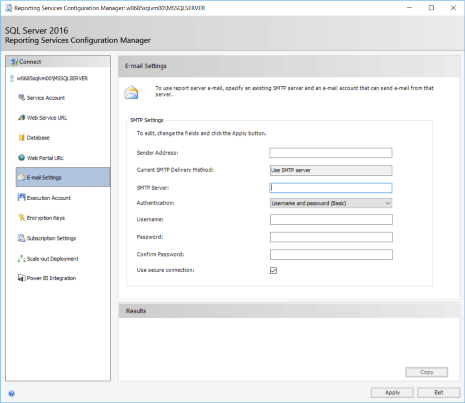
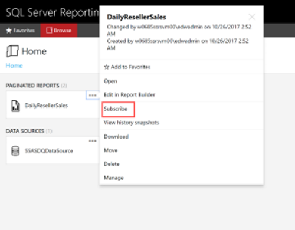

# Configuring Reporting Services
**SQL Server Reporting Services (SSRS)** is part of Microsoft SQL Server services - SSRS, SSAS and SSIS. It is a server-based report generating software system that can create, deploy and manage traditional and mobile ready paginated reports via a modern web portal.

> Read more about [SQL Server Reporting Service](https://en.wikipedia.org/wiki/SQL_Server_Reporting_Services) and find [documentation here](https://docs.microsoft.com/en-us/sql/reporting-services/create-deploy-and-manage-mobile-and-paginated-reports).  

# Table Of Contents
1.	[Connect to SSRS Web Portal](#connect-to-ssrs-web-portal)
2.	[Subscribing to Reports via Email](#subscribing-to-reports-via-email)

# Connect to SSRS Web Portal
Deploying the solution, provisions two SSRS virtual machines front-ended by an [Azure Load balancer](https://azure.microsoft.com/en-us/services/load-balancer/) for high availability and performance. Follow the next steps to connect to the SSRS admin web-portal.  
1. Obtain the **SSRS** load balancer url from the deployment summary page.
    > *e.g.* `http://<your-prefix>ssrslb.ciqsedw.ms/reports`.

    

2. Browse to the SSRS load balancer url.
3. Enter the admin credentials on the prompt. 
	- Username name **must** be a user that can authenticate against the SQL Server in the format **domain\username**. For instance `ciqsedw\edwadmin`. 
	- Password is the SSRS admin password.  

    

4. If everything works correctly, you should now have successfully authenticated and can access the reports and data sources.   
    

# Subscribing to Reports via Email
> This step is not automated by the solution, however, you can manually configure a custom SMTP server, such as SendGrid.

## 1. Create SendGrid SMTP account on Azure
1. Go to the [Azure portal](portal.azure.com).
2. Search the market place for **SendGrid Email Delivery**.
3. Create a new SendGrid account.

    

4. Find the SendGrid account created under your subscription. 
5. Go to **All settings** -> **Configurations**. Get the following:
	- Username 
	- Password
	- SMTP Server address

      

> **NOTE:** Password is the same one created when the SendGrid account was created. 

## 2. Enter SendGrid credentials into Reporting Server
1. Connect to both of your **SSRS Servers** using Remote Desktop.
2. Open the **Reporting Services Configuration Manager**.
3. Connect to the server instance.

   

4. On the left tabs, click on `Email Settings` and fill out the following
	- Sender email address
	- SMTP Server (smtp.sendgrid.net)
	- Username 
	- Password/Confirm Password

    

5. Click Apply. 

> **Note:** There is no need to restart the Reporting Server service. It takes the most recent configuration. 

## 3. Subscribe to a report to receive email delivery
1. Navigate to the Reporting Server web portal
1. Right click on any paginated report you want to subscribe to.
2. Click on **Subscribe**

    

3. When the page loads, make sure the following options are set correctly.
	- The **Owner** field points to a user that can query the SQL Server.
	- Select **Destination (Deliver the report to:)** as Email.
	- Create a schedule for report delivery.
	- Fill out the **Delivery options (E-mail)** fields.
	- Click on **Create subscription**.

    

4. If the subscription was successful, the page reloads to the home page.

    

5. Find your existing subscriptions, per report, by clicking on the gear icon at the top right hand side of the page and clicking **My Subscriptions** .
