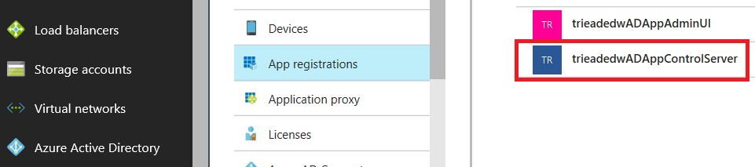
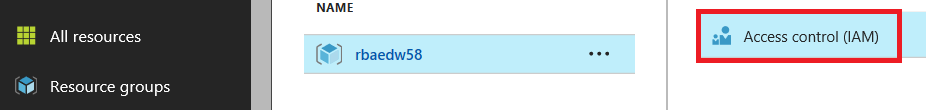

# User Access Control

It is essential that you manage which users have access to your deployment. In particular, you should control access to the Admin UI and Control Server apps, as well as the underlying Azure resources that comprise the solution. For additional resources on how to manage user access for apps click [here](https://docs.microsoft.com/en-us/azure/active-directory/active-directory-managing-access-to-apps) and for Azure resources click [here](https://docs.microsoft.com/en-us/azure/active-directory/role-based-access-control-configure).

Otherwise, here are some steps to get you started.

## Manage Access to the Admin UI and Control Server
[Azure Active Directory (AAD)](https://docs.microsoft.com/en-us/azure/active-directory/active-directory-whatis) is the service used to authenticate and authorize users. You will configure the two registered AAD apps in your deployment, the Admin UI and the Control Server, to only allow access to the users that you add. Users not added will not be able to access either app.

First, sign in to the Azure portal with an account that’s a [global admin]( https://docs.microsoft.com/en-us/azure/active-directory/active-directory-assign-admin-roles-azure-portal#details-about-the-global-administrator-role) for the directory.

### Admin UI
Click **Azure Active Directory** > **App registrations** > the Admin UI app.

For example:


Click the link under **Managed application in local directory** > **Properties** > **User assignment required** > **Yes** > **Save**. At this point, only users you add will have access to the Admin UI.

To add users, click **Users and groups** > **Add user** > **Users and groups**. Type in the email of the user to add and click **Invite**. Do this for each user. Only the users you added will now have access to the Admin UI.

### Control Server
Click **Azure Active Directory** > **App registrations** > the Control Server app.

For example:


Click the link under **Managed application in local directory** > **Properties** > **User assignment required** > **Yes** > **Save**. At this point, only users you add will have access to the Control Server.

To add users, click **Users and groups** > **Add user** > **Users and groups**. Type in the email of the user to add and click **Invite**. Do this for each user. Only the users you added will now have access to the Control Server.

## Manage access to the Azure resources

Most of the users of your deployment will not need access to the underlying Azure resources. For those that do, you should only grant the access that users need. For example, a non-administrator user should not have write privileges where they could delete the resource group. 

Role Based Access Control (RBAC) enables fine-grained access management to the underlying Azure resources of your deployment. Using RBAC, you can grant only the amount of access that users need to perform their jobs. You can add users to the resource group with roles appropriate to their needed level of access. The three most basic roles are:

- **Owner** – Lets you manage everything, including access to resources.
- **Contributor** – Lets you manage everything except access to resources.
- **Reader** – Lets you view everything, but not make any changes.

Here are the steps to do this:

First, sign in to the Azure portal with an account that’s the subscription owner. Click **Resource groups** > your resource group > **Access control (IAM)**.

For example:


Click **Add**, select a role appropriate for the user, type in the email of the users to add, and click **Save**. The users you added will now have role based access to the Azure resources.

> Note that user roles can also be inherited from the parent subscription. If you want to modify a role inherited from the parent subscription, click **Subscription (inherited)** and modify it at the subscription level.

## Manage app access by instrumenting the deployment code

In the previous sections we discussed how to whitelist user access to the apps. If you want more granular control for individual functions within the app itself, you need to instrument the app code. This section describes how to do just that. Click [here](https://docs.microsoft.com/en-us/aspnet/core/security/authorization/roles) for additional reading on role based authorization in ASP.NET MVC web apps.

> Note that the code for your deployment is not released, nor is it currently instrumented for RBAC, so this section describes in general terms how a developer would do this for an app.

Now let's get started.

### Basic syntax

Role based authorization checks are declarative. The developer embeds them within their code, against a controller or an action within a controller. For example, the following code would limit access to any actions on the **AdministrationController** to users who are a member of the **Administrator** group.

```csharp
[Authorize(Roles = "Administrator")]
public class AdministrationController : Controller {
}
```

Role requirements can also be expressed using the new Policy syntax, where a developer registers a policy at startup as part of the Authorization service configuration. This normally occurs in ConfigureServices() in your Startup.cs file. Here is an example:

```csharp
public void ConfigureServices(IServiceCollection services) {
    services.AddMvc();
    services.AddAuthorization(options => {
        options.AddPolicy("RequireAdministratorRole", policy => policy.RequireRole("Administrator"));
    });
}

[Authorize(Policy = "RequireAdministratorRole")]
public IActionResult Shutdown() {
    ...
}
```

By the way, you are not restricted to the [existing roles](https://docs.microsoft.com/en-us/azure/active-directory/role-based-access-built-in-roles) in AAD. You can define your own [custom roles](https://docs.microsoft.com/en-us/azure/active-directory/role-based-access-control-custom-roles), as well as your own [custom policies](https://docs.microsoft.com/en-us/aspnet/core/security/authorization/policies).

### Where to do it

Now that you know how to do it, where in the app code might you want to make these changes? A good starting point might be to review the exposed actions in your app.

For example, in your deployment the Control Server has several exposed actions. You can see all the Control Server actions by first connecting to the VPN client for your deployment then using the OData API endpoint - you see it on the final page of your deployment - and browsing to:

```
https://<your odata api>.adminui.ciqsedw.ms:8081/odata/$metadata
```

You will see an XML document describing all the exposed Control Server endpoints. If you scan the XML, you can see all the exposed Control Server actions. For example:

- CreateAndInitializeTabularModelTablePartition
- UpdateRangeStatus
- ClaimNextReadOnlyNodeToRestore
- BackupOfPartitionStatesCompleted
- CompleteRestoreForReadOnlyNode
- FlipLdwState
- FlipPdwState
- FlipAliasNodeState
- IsReadyToFlip
- ReportTransitionStatus
- RetryDwTableAvailabilityRangeJobs

The next step would be to instrument the code as described in the previous section to only allow execution by users affiliated with a certain role.
